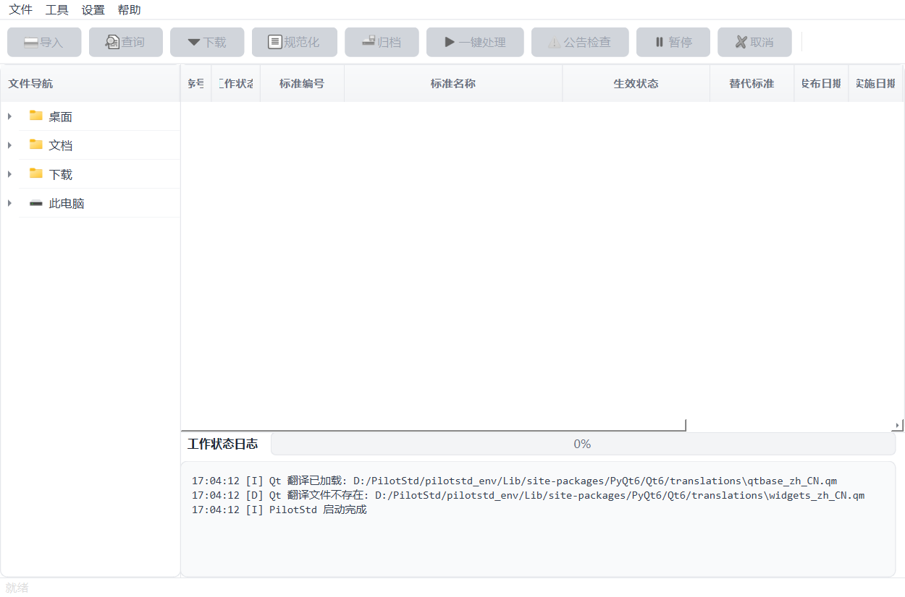

# PilotStd — 标准文件管理工具

自动识别标准号 · 多站点有效性查询 · 批量下载 · 分类归档

[](https://github.com/leanmore/pilotstd/actions/workflows/ci.yml)
[](https://github.com/leanmore/pilotstd/actions/workflows/ci.yml)
[](https://github.com/leanmore/pilotstd/actions/workflows/ci.yml)
[](https://github.com/leanmore/pilotstd/releases)
[](https://www.python.org/)
[](LICENSE)

## 功能特性

- **标准号解析** — 支持 GB/JB/HG/SH/ISO/ASME/BS/DIN/JIS 等 94 类标准代号，自动识别年份、部分号、语种
- **多站点查询** — 6 个适配器覆盖国家标准、行业标准、国际标准，含缓存和冷却机制
- **批量下载** — 采标自动检测跳过，验证码自动识别（ddddocr），去重避免重复下载
- **智能归档** — 按行业自动分目录，Word 源目录镜像，废止文件移入过期作废目录
- **公告监控** — 定期拉取国家标准公告，交叉比对本地标准库，发现更新自动提醒
- **双端可用** — PyQt6 桌面端 + Docker Web 端，共享同一引擎

## 界面展示



## 快速开始

```bash
# 克隆仓库
git clone https://github.com/leanmore/pilotstd.git
cd pilotstd

# 桌面端
pip install -r desktop/requirements-win.txt
python main.py

# Docker Web 端
docker compose up -d
# 访问 http://localhost:9028，首次启动日志中查看自动生成的凭证
```

## 部署方式

| 方式 | 说明 |
|---|---|
| **PyInstaller exe** | Windows 单文件，无需 Python，[Release 页下载](https://github.com/leanmore/pilotstd/releases) |
| **Docker 镜像** | `docker compose up -d`，镜像自动推送 `ghcr.io/leanmore/pilotstd:latest` |
| **源码运行** | `pip install -r desktop/requirements-win.txt && python main.py` |

## 依赖文件

| 文件 | 环境 |
|------|------|
| `requirements.txt` | 三端共享基础依赖 |
| `desktop/requirements-win.txt` | Windows 桌面（PyQt6 + 共享依赖） |
| `docker/requirements-docker.txt` | Docker Web（FastAPI + JWT + 共享依赖） |
| `requirements-dev.txt` | 开发（pytest + ruff + PyInstaller + locust） |

## 技术栈

| 层次 | 技术 |
|---|---|
| 桌面 GUI | PyQt6 + Qt 多语言（简中/繁中/English） |
| Web 前端 | Vue3 + PrimeVue + TypeScript |
| Web 后端 | FastAPI + JWT + SQLite |
| 构建 | PyInstaller（exe）+ Docker 多阶段构建 |
| CI/CD | GitHub Actions（测试 + 构建 + 自动发布） |

## 目录结构

```
PilotStd/
├── main.py              # 程序入口（GUI / CLI）
├── pilotstd/            # 核心引擎
│   ├── scan/            # 文件扫描 + 标准号解析
│   ├── query/           # 查询引擎 + 7 个适配器
│   ├── download/        # 下载引擎
│   ├── organizer/       # 分类归档
│   ├── announcement/    # 公告监控
│   ├── ui/              # PyQt6 桌面界面
│   ├── cli/             # 命令行接口
│   ├── manager/         # 业务门面
│   ├── pipeline/        # 分类路由
│   ├── quality/         # 代码质量检查
│   └── core/            # 配置 / 数据库 / 工具
├── desktop/             # 桌面端打包配置 + 图标
├── web/                 # Vue3 前端
├── docker/              # FastAPI 后端 + Docker 配置
├── tests/               # 测试
├── scripts/             # 辅助脚本
└── assets/              # 截图等静态资源
```

## 开发与测试

```bash
# 安装开发依赖
pip install -r requirements-dev.txt

# 运行后端全量测试（含 SQLite 临时数据库隔离）
python -m pytest tests/ -k "not gui"

# 运行前端单元测试
cd web && npx vitest run

# 运行前端 E2E 测试（Playwright，后端用 docker/app.py，不依赖 PyQt6）
# 终端 1：启动 API 服务
uvicorn docker.app:app --host 0.0.0.0 --port 9028
# 终端 2：运行 E2E
cd web && npx playwright test e2e/

# 相对导入有效性检查
python scripts/fix_relative_imports.py
```

## 许可证

MIT License — 详见 [LICENSE](LICENSE)。
