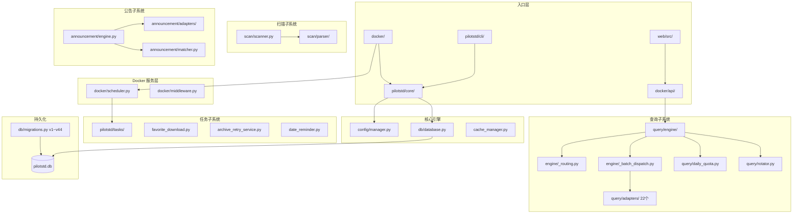

# PilotStd 项目架构总览

> 最后更新：2026-07-27 | 基于 main 分支最新代码

## 技术栈

| 技术 | 版本 | 选型理由 |
|------|------|----------|
| Python | 3.11+ | `str | None` 联合类型语法、asyncio 改进 |
| FastAPI | 0.100+ | 异步支持、自动 OpenAPI 文档、Pydantic 集成 |
| APScheduler | 3.x | CronTrigger 原生支持、BackgroundScheduler 轻量 |
| SQLite | 3.35+ | 零配置部署、WAL 模式并发、单文件便携 |
| Vue 3 | 3.4+ | Composition API、TypeScript 原生支持 |
| PrimeVue | 3.x | 企业级 UI 组件库、DataTable 虚拟滚动 |
| Vite | 5.x | 极速 HMR、Tree-shaking |

## 模块关系图



## 核心模块职责

### CLI 入口 [src: `pilotstd/cli/`]
- 命令行交互界面，支持 `query`、`scan`、`organize` 等子命令
- 入口：[pilotstd/cli/commands/query.py](pilotstd/cli/commands/query.py)
- 入口：[pilotstd/cli/commands/announce.py](pilotstd/cli/commands/announce.py)

### Docker API 层 [src: `docker/`]
- FastAPI 路由定义，RESTful 接口
- 主入口：[docker/app.py](docker/app.py) — 路由注册 + 调度器启动
- API 路由：[docker/api/query.py](docker/api/query.py)、[docker/api/announce.py](docker/api/announce.py)、[docker/api/validity.py](docker/api/validity.py)
- 调度器：[docker/scheduler.py](docker/scheduler.py) — APScheduler BackgroundScheduler，模块级全局单例

### 核心引擎 [src: `pilotstd/core/`]
- 配置管理：[pilotstd/core/config/manager.py](pilotstd/core/config/manager.py) — 点分隔 JSON 持久化 + 原子替换
- 数据库：[pilotstd/core/db/database.py](pilotstd/core/db/database.py) — sqlite3 封装，WAL 模式
- 迁移：[pilotstd/core/db/migrations.py](pilotstd/core/db/migrations.py) — v1~v44 装饰器注册模式
- 缓存：[pilotstd/core/cache_manager.py](pilotstd/core/cache_manager.py) — 版本驱动失效策略

### 查询引擎 [src: `pilotstd/query/engine/`]
- 入口：[pilotstd/query/engine/__init__.py](pilotstd/query/engine/__init__.py) — `QueryEngine` 类
- 路由（v1）：[pilotstd/query/engine/_routing.py](pilotstd/query/engine/_routing.py) — `_resolve_base_route()` 7 层决策树
- **路由（v2，灰度中）**：[pilotstd/query/routing/router_v2.py](pilotstd/query/routing/router_v2.py) — 三级漏斗（L1 国内精准 → L2 有标准号综合兜底 → L3 模糊探索），`ROUTING_ENGINE_VERSION=v2` 启用（2026-08-17 起灰度，默认 v1）
- 分桶：[pilotstd/query/engine/_batch_dispatch.py](pilotstd/query/engine/_batch_dispatch.py) — 6 阶段流水线
- 小桶：[pilotstd/query/engine/_mini_bucket.py](pilotstd/query/engine/_mini_bucket.py) — 50 条/桶 + 权重重分配
- 单条：[pilotstd/query/engine/_single.py](pilotstd/query/engine/_single.py) — 5 步搜索链路（v2 分支 `_query_one_v2` 链式降级）

### 适配器层 [src: `pilotstd/query/adapters/`]
- 22 个查询适配器，基类 [pilotstd/query/adapters/base.py](pilotstd/query/adapters/base.py)
- 注册表：[pilotstd/query/adapters/registry.py](pilotstd/query/adapters/registry.py) — `ALL_ADAPTERS` 静态字典
- 配额：[pilotstd/query/daily_quota.py](pilotstd/query/daily_quota.py) — SQLite 持久化日计数器
- 冷却：[pilotstd/query/rotator.py](pilotstd/query/rotator.py) — `SiteRotator` 全局进程级

### 任务子系统 [src: `pilotstd/tasks/`]
- 收藏下载：[pilotstd/tasks/favorite_download.py](pilotstd/tasks/favorite_download.py) — `download_to_inbox()` 操作 `favorite_downloads` 表（v44 解耦后）
- 重试服务：[pilotstd/manager/archive_retry_service.py](pilotstd/manager/archive_retry_service.py) — 冷却期 + 7 次重试 + abandoned
- 日期提醒：[pilotstd/tasks/date_reminder.py](pilotstd/tasks/date_reminder.py) — 30/15/7/0 天四级提醒

## 数据流向：标准查询完整链路

```
用户输入 "GB/T 1.1-2020"
  │
  ├─ 1. API 入口
  │   POST /api/query                  [docker/api/query.py:19]
  │   └─ mgr.query_by_numbers()        [manager/facade/_query.py:109]
  │
  ├─ 2. 解析
  │   scheduled_svc.query_by_numbers()  [manager/scheduled_service.py:141]
  │   └─ parser.parse("GB/T 1.1-2020") → logical_code="GB/T", number=1, year=2020
  │
  ├─ 3. 路由决策
  │   _resolve_base_route("GB/T")       [engine/_routing.py:35]
  │   └─ classify_std_code() → "gb"    [core/std_utils.py:15]
  │      └─ ADAPTER_TYPE_MAP["gb"]     [search_strategy.py:252]
  │         → [ahbz(30%), std_gov(40%), njbz365(25%), csres(5%)]
  │
  ├─ 4. 查询执行
  │   _query_one()                     [engine/_single.py:143]
  │   ├─ Step1: 缓存查找               [:44-53]
  │   ├─ Step2: 优先级链过滤           [:55-69]
  │   ├─ Step3: 逐适配器查询           [:71-121]
  │   │   └─ adp.query_with_strategy() [adapters/base.py:115]
  │   │      └─ _search_progressive()   [:129-161]
  │   │         └─ 完整号 → 空格回退 → 去前缀 → 去年份 → 变体
  │   ├─ Step4: 配额耗尽兜底           [:123-130]
  │   └─ Step5: 未找到兜底             [:132-139]
  │
  └─ 5. 结果返回
      QueryResult(standard_number, status, match_status)
      └─ 缓存写入 → JSON 序列化 → HTTP 响应
```

### 批量查询旁路

```
多条查询 → query_batch_parsed()         [engine/_batch.py:97]
  ├─ Phase1: _init_batch_state()        [_batch_dispatch.py:29]
  ├─ Phase2: _bucket_items()            [:92]
  ├─ Phase3: _setup_dispatch_context()  [:107]
  ├─ Phase4: _dispatch_queries()        [:227]
  │   ├─ 8 线程池: _bucket_worker()     [:178]
  │   └─ csres 后台线程                [_csres.py:59]
  ├─ Phase5: _collect_csres_results()   [:281]
  ├─ Phase6: _handle_overflow()         [_overflow.py:164]
  └─ _finalize_batch()                  [_batch_dispatch.py:300]
      └─ batch_state INSERT              [:347-365]
```

## 数据库表全景

| 表名 | 迁移版本 | 用途 |
|------|---------|------|
| `announcement_record` | v15 | 公告与标准号关联 |
| `standard_info_cache` | v23 | 查询结果缓存（版本驱动失效） |
| `standard_validity` | v16 | 时效性检查状态 |
| `user_favorites` | v36 | 收藏关系（v44 解耦后仅存二元语义） |
| `favorite_downloads` | v44 | 归档下载状态机（v44 新建） |
| `batch_state` | v43 | 断点续传批次状态 |
| `query_metrics` | v43 | Metrics 计数器持久化 |
| `daily_quota` | v11 | 适配器日配额追踪 |
| `adapter_state` | v33 | 冷却/URL 状态持久化 |
| `standards` | v42 | 标准归档四要素表 |
| `date_reminder_log` | — | 日期提醒发送记录 |

## 关键设计决策

1. **组合模式替代 Mixin**：[EngineCore](pilotstd/query/engine/_core_types.py:22) 作为依赖容器注入各 Handler，消除 MRO 隐式依赖
2. **静态注册表**：[ALL_ADAPTERS](pilotstd/query/adapters/registry.py:32) 静态字典，无运行时动态注册
3. **双配额体系**：`SiteRotator`(轮转冷却) + `DailyQuotaTracker`(日配额)，互不耦合
4. **进程级全局冷却**：[SiteRotator._sites](pilotstd/query/rotator.py:53) 单例 + `threading.Lock`，跨批次实时影响
5. **收藏归档表级解耦**：v44 迁移将 `favorite_downloads` 独立，`user_favorites` 回归纯粹收藏
